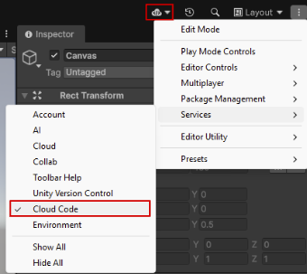
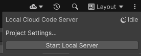
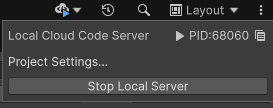
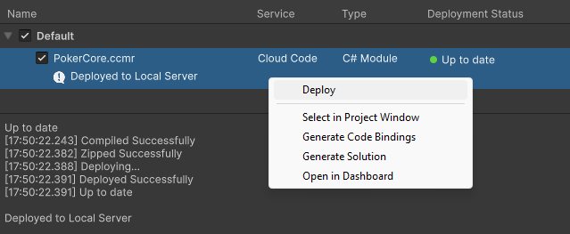
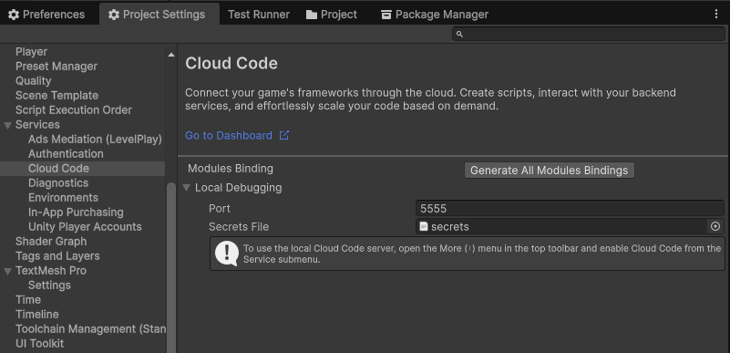

# Local Cloud Code Debugging

Local Cloud Code Debugging accelerates backend development by enabling you to instantiate a Cloud Code server with C#
modules deployed directly on your local machine. This allows you to iterate rapidly on game server logic in isolation,
bypassing the need to push to a remote environment for every change. 

More importantly, it unlocks diagnostic
capabilities by allowing you to attach a debugger to the local process, granting the ability to set breakpoints, step
through execution, and inspect memory to resolve complex server issues at runtime in play mode.

## Prerequisites

To use Local Cloud Code Debugging, ensure that you have the following setup:

1. A Unity Editor version of at least 6000.3 and up. 
2. Followed the setup prerequisites for [Cloud Code Modules](./cloud_code_modules.md#prerequisites)
3. If you have existing Modules, ensure the following Nuget packages are referenced:
   1. com.unity.services.cloudcode.apis - v0.0.22
   2. com.unity.services.cloudcode.core - v0.0.3
4. You have [.Net 9.0](https://dotnet.microsoft.com/en-us/download/dotnet/9.0) installed on your machine. 

> [!NOTE]
> **Note:** Local Cloud Code Debugging is only supported for Cloud Code Modules. Cloud Code Scripts are _not_ supported.

## Local Cloud Code toolbar

All local server settings and operations can be accessed through the Cloud Code toolbar. This toolbar is disabled by 
default, and can be enabled through the main toolbar menu (Top right Toolbar Context Menu > Services > Cloud Code).
If enabled, you should see a Cloud Code icon appear in the top right area of the toolbar in the editor.



## Executing Modules on the local server

To execute C# server functions on the local server from your game, we must first start the local server and deploy your 
Cloud Code Modules onto it. This can be done via the Start local Server button in the Cloud Code toolbar's popup window controls.



Starting the local server automatically compiles and deploys all Cloud Code Module References in your project 
onto that server. Take note that the state of the local server, if it's currently idle, starting, or running (its PID is shown), 
is shown both within the popup window and toolbar icon.



Alternatively, any subsequent code changes to your modules can be 'hot reloaded' onto the started server by simply 
restarting the server, or redeploying the desired module through the deployment window:



With your deployed C# modules on the local server, server calls made from your game in play mode are now redirected to
the local server. It is important to note: The determination of "local vs remote" server call switch is made right
when you enter play mode in the Editor. If the local server is running, all server calls are directed locally. Likewise,
if the local server is not running as you enter play mode - all server calls are directed remotely.

> [!NOTE]
> **Note:** Multiplayer Play Mode is not fully supported with Local Cloud Code Debugging.
> Local server calls can only be done so from [Additional Editor Instances](https://docs.unity3d.com/Packages/com.unity.multiplayer.playmode@2.0/manual/instance-types/main-and-additional-editor-instances.html)
> that are activated _after the local server has started_. Calls from any other instance types are always directed remotely. 

## Additional local server settings

You can also configure the local server _before_ starting it with additional settings. This can be accessed through 
(File > Project Settings > Services > Cloud Code).



* **Port** - The local port on your machine on which your local server will listen for calls.
* **Secrets File** - A Json asset containing Key-Value secret pairs to be [retrieved](https://docs.unity.com/ugs/en-us/manual/secret-manager/manual/tutorials/integrations/cloud-code/modules) from in your Cloud functions.

> [!NOTE]
> **Note:** To [retrieve](https://docs.unity.com/ugs/en-us/manual/secret-manager/manual/tutorials/integrations/cloud-code/modules) 
> secrets, please update your ModuleConfig as shown below to reference the latest APIs for Local Cloud Code Debugging. 

```
public class ModuleConfig : ICloudCodeSetup
{
    public void Setup(ICloudCodeConfig config)
    {
        // Old Approach - will be deprecated, please remove.
        // config.Dependencies.AddSingleton(GameApiClient.Create());

        // Replace with this for version v0.0.22+
        config.AddGameApiClient();
    }
}
```
