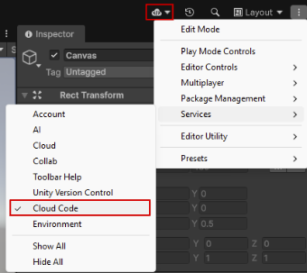
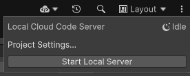
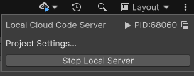
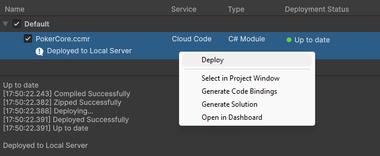
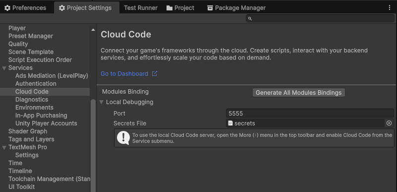

# Local Cloud Code Debugging

Local Cloud Code Debugging accelerates backend development by enabling you to instantiate a Cloud Code server with C#
modules deployed directly on your local machine. This allows you to iterate rapidly on game server logic in isolation,
bypassing the need to push to a remote environment for every change.

The local server also runs as an ordinary .NET process on your machine, so you can attach your IDE's debugger to it
using **Attach to Process** and set breakpoints in your module code. The server is started as `dotnet`, so identify it
by the PID shown in the Cloud Code toolbar popup (see [Local server status](#executing-modules-on-the-local-server)).

## Prerequisites

To use Local Cloud Code Debugging, ensure that you have the following setup:

1. A Unity Editor version of at least 6000.3 and up.
2. Followed the setup prerequisites for [Cloud Code Modules](./cloud_code_modules.md#prerequisites)
3. If you have existing Modules, ensure the following Nuget packages are referenced:
   1. com.unity.services.cloudcode.apis - v0.0.27
   2. com.unity.services.cloudcode.core - v0.0.7
4. You have the [ASP.NET Core Runtime 8.0](https://dotnet.microsoft.com/en-us/download/dotnet/8.0) installed on your
   machine. The local server needs both the `Microsoft.NETCore.App` and `Microsoft.AspNetCore.App` shared frameworks:
   the ASP.NET Core Runtime provides both, as does the .NET SDK. The plain ".NET Runtime" download provides only the
   former and is not enough to start the server.

> [!NOTE]
> **Note:** Local Cloud Code Debugging is only supported for Cloud Code Modules. Cloud Code Scripts are _not_ supported.

## Local Cloud Code toolbar

All local server settings and operations can be accessed through the Cloud Code toolbar. This toolbar is disabled by
default, and can be enabled through the main toolbar menu (Top right Toolbar Context Menu > Services > Cloud Code).
If enabled, you should see a Cloud Code icon appear in the top right area of the toolbar in the editor.



## Executing Modules on the local server

To execute C# server functions on the local server from your game, we must first start the local server and deploy your
Cloud Code Modules onto it. This can be done via the Start local Server button in the Cloud Code toolbar's popup window controls.



Starting the local server automatically compiles and deploys all Cloud Code Module References in your project
onto that server. Take note that the state of the local server, if it's currently idle, starting, or running (its PID is shown),
is shown both within the popup window and toolbar icon.



While the server is running, a module whose source has changed is recompiled and 'hot reloaded' onto it for you -
the server picks up the new module on the next call, so there is no need to stop and start it, or to redeploy from
the deployment window. Each reload names the modules it carried in the Console, so you can see the change land
without calling the module to find out:

* **Cloud Code Module References** are redeployed when the Editor regains focus, which includes editing their
  solution in an external IDE. This also works while you stay in play mode.
* **Cloud Code Modules** are redeployed once the Editor has recompiled them, since what they deploy is the
  assembly Unity compiles from their source. This happens outside play mode only.

You can still redeploy a module by hand from the deployment window at any time:



> [!NOTE]
> **Note:** A Cloud Code Module is not redeployed while you are in play mode. Its deployed form is the
> assembly Unity compiles for it, and Unity cannot rebuild that reliably during play. If you change one
> while playing, the Console tells you which modules changed - exit play mode and enter it again to run the
> new code.
>
> Cloud Code Module References are unaffected and keep redeploying in play mode: their solution is built
> outside Unity, so nothing has to recompile.

With your deployed C# modules on the local server, server calls made from your game in play mode are now redirected to
the local server. It is important to note: The determination of "local vs remote" server call switch is made right
when you enter play mode in the Editor. If the local server is running, all server calls are directed locally. Likewise,
if the local server is not running as you enter play mode - all server calls are directed remotely.

> [!NOTE]
> **Note:** Multiplayer Play Mode is not fully supported with Local Cloud Code Debugging.
> Local server calls can only be done so from [Additional Editor Instances](https://docs.unity3d.com/Packages/com.unity.multiplayer.playmode@2.0/manual/instance-types/main-and-additional-editor-instances.html)
> that are activated _after the local server has started_. Calls from any other instance types are always directed remotely.

## Additional local server settings

You can also configure the local server _before_ starting it with additional settings. This can be accessed through
(File > Project Settings > Services > Cloud Code).



* **Port** - The local port on your machine on which your local server will listen for calls.
* **Secrets File** - A Json asset containing Key-Value secret pairs to be [retrieved](https://docs.unity.com/ugs/en-us/manual/secret-manager/manual/tutorials/integrations/cloud-code/modules) from in your Cloud functions.

> [!NOTE]
> **Note:** To [retrieve](https://docs.unity.com/ugs/en-us/manual/secret-manager/manual/tutorials/integrations/cloud-code/modules)
> secrets, please update your ModuleConfig as shown below to reference the latest APIs for Local Cloud Code Debugging.

```
public class ModuleConfig : ICloudCodeSetup
{
    public void Setup(ICloudCodeConfig config)
    {
        // Old Approach - will be deprecated, please remove.
        // config.Dependencies.AddSingleton(GameApiClient.Create());

        // Replace with this for version v0.0.22+
        config.AddGameApiClient();

        // Optional: registers IAdminApiClient the same way, if your module uses admin APIs.
        config.AddAdminApiClient();
    }
}
```

## What the local server reproduces, and what it does not

The local server is a faithful rehearsal for most of a Module's behaviour, but not for all of it.
Use this table to tell whether a design can be iterated on locally before you deploy it.

| Behaviour | Locally | Notes |
| --- | --- | --- |
| Module endpoint calls | Local | Play mode routes to `http://localhost:<port>`. |
| Module state, scoped state and timers | Local | Persisted on disk next to your modules, not in the deployed state store. |
| Push messages and subscriptions | Local | The server hosts its own push endpoint, so messages never leave your machine. Requires `com.unity.services.wire` 1.6.0 or newer; an older version sends subscriptions to the cloud, which rejects the local server's channel tokens. |
| `Access.Service`, `Access.SessionMember`, `Access.SessionHost` | Enforced | The same access checks the deployed service runs. |
| Multiplayer session membership | Enforced, against the live Lobby service | A session id with no lobby behind it fails locally the same way it fails deployed. Your machine needs network access and the project needs an active environment. |
| `ICall.ForScope` cross-scope calls | Local | The server points the Module's own Cloud Code client at itself, so a cross-scope call stays on the local server instead of reaching the deployed module. |
| Player identity | **Not validated** | There is no local Player Auth backend, so the caller's player id is trusted as sent. A deployed Module rejects a token it cannot verify; the local server does not. |
| Secret Manager, Cloud Save, Economy and other service calls | Live | Server-side calls go to the real services for your active environment, using a real service token. They are not sandboxed. |
| Scope-addressed push channels | Not available | A Module publishing to a scope channel rather than to individual players has no local equivalent yet. |

Two consequences worth planning around:

* **Local or remote is decided when you enter play mode**, from whether the server is running. The
  server is stopped when you quit the Editor, so the first play session after reopening a project
  is remote - and remote invocations are billed. The Cloud Code toolbar shows which one you are in.
* **Other services are not sandboxed.** Local debugging isolates your Module's own state and push
  traffic. Everything the Module then calls - Cloud Save, Economy, Secret Manager, Lobby - is the
  real service for your active environment, and writes it makes are real writes.
