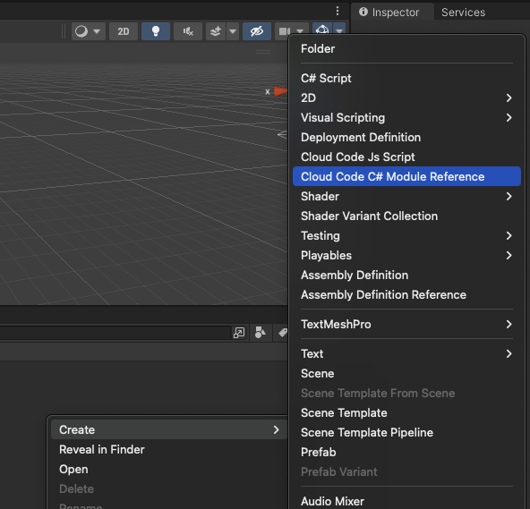
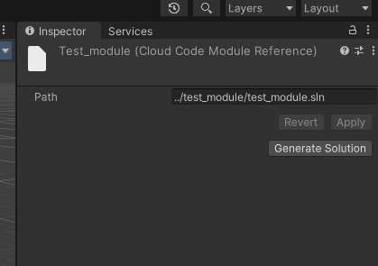
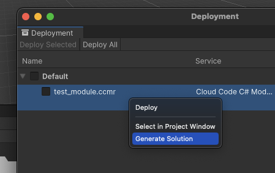

# Cloud Code Modules

You can use the Unity Editor to create and deploy Cloud Code modules.
The Cloud Code package contains the Cloud Code Authoring module, which allows you to use the [Deployment package](https://docs.unity3d.com/Packages/com.unity.services.deployment@1.0/manual/index.html) to interact with modules.

For more detailed information about Cloud Code Modules, go ot the [manual documentation](https://docs.unity.com/ugs/en-us/manual/cloud-code/manual/modules).

> [!NOTE]
> **Note:** Only Unity 2021.3 and above support Unity Editor integration for modules.

## Prerequisites

To use Cloud Code in the Unity Editor, follow the steps below.

### Link project

Link your [Unity Gaming Services project](../../../../../overview/manual/managing-unity-projects.md) with the Unity Editor. You can find your UGS project ID in the Unity Cloud Dashboard.

1. In Unity Editor, select **Edit** > **Project Settings** > **Services**.

2. Link your project.

    * If your project doesn't have a Unity project ID:

        1. Select **Create a Unity Project ID** > **Organizations**, then select an organization from the dropdown menu.
        2. Select **Create project ID**.

    * If you have an existing Unity project ID:

        1. Select **Use an existing Unity project ID**.
        2. Select an organization and a project from the dropdown menus.
        3. Select **Link project ID**.

Your Unity Project ID appears, and the project is now linked to Unity services.

You can also use the `UnityEditor.CloudProjectSettings.projectId` parameter to access your project ID in a Unity Editor script.

### Install .NET

To deploy Cloud Code Modules in the editor you must first install [.NET](https://dotnet.microsoft.com/en-us/).

Follow the steps below to set your default .NET path in editor:

1. In the Unity Editor, select **Edit** > **Preferences…** > **Cloud Code**.
2. In the **.NET development environment** section, modify your **.NET path** to the one you have it installed.
3. Select **Apply**.

### Install required packages

To create Cloud Code modules within the Editor, you must install the following packages:

* Deployment
* Cloud Code (2.5.0 or higher)

> [!NOTE]
> **Note:** Check [Unity - Manual: Package Manager window](https://docs.unity3d.com/Manual/upm-ui.html) to familiarize yourself with the Unity Package Manager interface.

Install these packages, and add them to your list of available packages:

1. From the Unity Editor’s Package Manager window, select **+ (add)** > **Add package by name…**.
2. Enter `com.unity.services.deployment`.
3. Select **Add**.
4. Repeat these steps for `com.unity.services.cloudcode`.

## Preview the Deployment window

The Deployment window allows you to deploy Cloud Code modules to your remote environment.
If you installed the Deployment package, you can access it from the Unity Editor.

* In Unity Editor versions 2021.3+: Select **Window** > **Deployment**.
* In Unity Editor versions 2022+: Select **Services** > **Deployment**.

Before you can use the Deployment window, you have to select the environment you want to deploy to.

> [!NOTE]
> **Note**: The Deployment window also supports other Unity Gaming services. If your Cloud Code modules rely on other services, you can deploy changes at the same time.

Refer to the [Deployment window](https://docs.unity3d.com/Packages/com.unity.services.deployment@1.0/manual/deployment_window.html) for more information.

## Author within Unity Editor

The installed Cloud Code package contains the Cloud Code Authoring module, which allows you to create and deploy Cloud Code modules directly from the Unity Editor.

To do this, create a module reference file in the editor and link it to your module project. Once configured, the Deployment window allows you to deploy your module to the remote environment.

### Create a C# Module Reference file

To get started, create a Cloud Code C# Module Reference file. This file is a reference to a solution containing the C# module project you want to deploy.

1. In the Unity Editor, right-click in the Project window, then select **Create** > **Cloud Code C# Module Reference**.
2. Name the module reference as you would your module to avoid confusion.
3. Press **Enter**.

> [!NOTE]
> **Note**: The module deployed has the same name as the main project in the solution.

 

The new module reference is now visible in the Project window and in the Deployment window. To access the module reference, select **Window** > **Deployment**.

### Link a module

The C# Module Reference needs to be linked to a module. You can either link an existing solution or generate a new one from the Unity Editor.

#### Link an existing module

If you want to use a different authoring method to create a new module, refer to [Write modules](https://docs.unity.com/ugs/en-us/manual/cloud-code/manual/modules/how-to-guides/write-modules).
The module reference comes with a default solution path. You should change this path to point to your existing module solution.

1. In the Unity Editor, select the module reference file in the Project window.
2. In the [Inspector](https://docs.unity3d.com/Manual/UsingTheInspector.html) window, modify the **Solution Path** field to point to your existing module solution.

#### Generate a new module

You can also generate a new module from the Unity Editor.

1. In the Unity Editor, select the module reference file in the Project window.
2. In the [Inspector](https://docs.unity3d.com/Manual/UsingTheInspector.html) window, click **Generate Solution**.

To generate a new module directly from the Deployment window, right click on the module reference file and select **Generate Solution**.

The default solution path is generated by using the reference file name.

The solution file name in the solution path is then used to generate the module template.

For example, if your reference file is called `test_module.ccmr`, your default solution path could be `../test_module`, which creates a module under a solution file of `test_module.sln`.

### Deploy modules

You can deploy modules through the Deployment window. You can also deploy automatically when you enter the Play mode in the Unity Editor.

Check the [Deployment package manual](https://docs.unity3d.com/Packages/com.unity.services.deployment@latest) for more information .

You can verify the deployment is successful by calling the module endpoints. The template module contains a default endpoint called `SayHello`.

Refer to [Run modules](https://docs.unity.com/ugs/en-us/manual/cloud-code/manual/modules/how-to-guides/run-modules) for more information.

### Generate Code Bindings

You can generate code bindings by selecting the CloudCode Module Reference in the **Project View**,
then clicking on the "Generate Bindings" button in the inspector.

Alternatively, you can select the CCMR in the deployment window, and select "Generate Bindings".

Another option is to use the toolbar, via **Services** > **CloudCode** > **Generate CloudCode Bindings**,
this will generate bindings for all existing CCMRs.

This option is also available in **Project Settings** > **CloudCode**.

Any of these methods will result in type-safe client code generated under:
`Assets/CloudCode/GeneratedModuleBindings/`.

> [!NOTE]
> **Note**: Currently, the bindings generation has the following limitations:
>
> - It will not make the difference between required parameters and optional parameters
> - Tuples are not supported as parameters or return value
